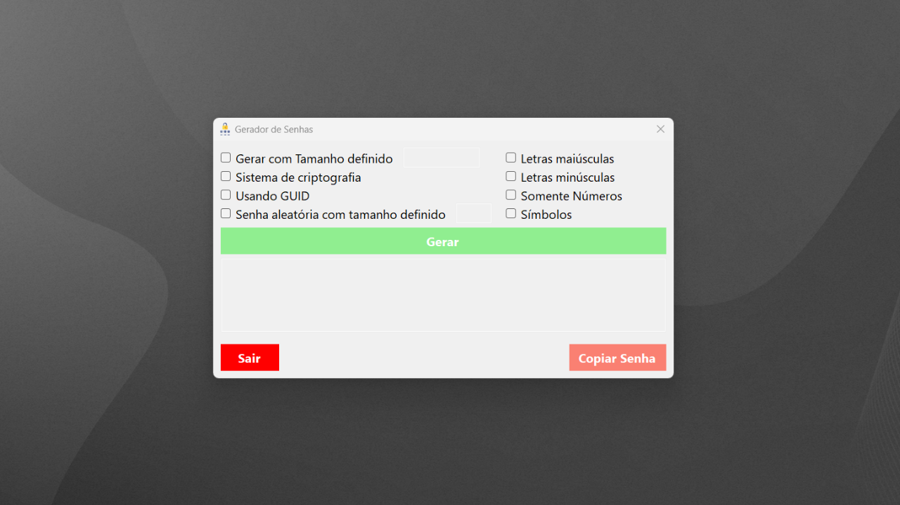
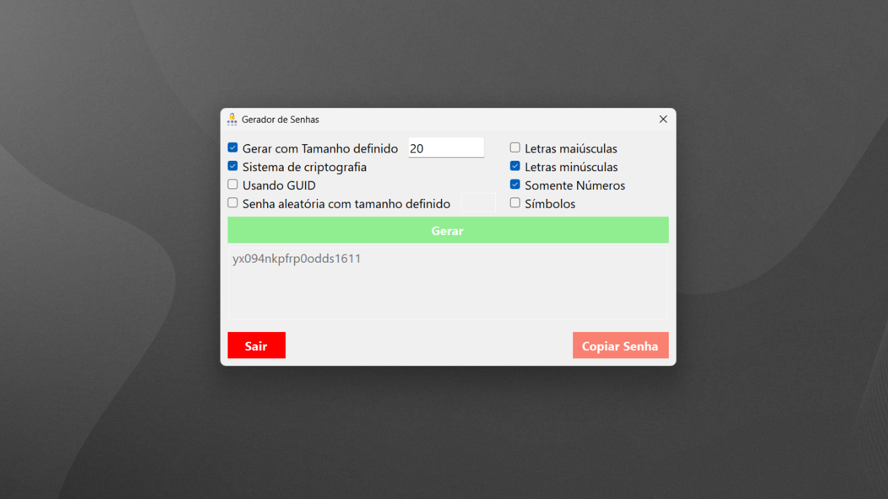

# 🔐 Gerador de Senhas - Aplicativo Desktop em C# (.NET 5.0, Windows Forms)

Este projeto consiste em um **Gerador de Senhas personalizável**, desenvolvido em **C# com Windows Forms** e baseado na plataforma **.NET 5.0**. O sistema possui uma interface gráfica intuitiva, com diversas opções para gerar senhas seguras e adaptáveis às necessidades do usuário.

## ⚙️ Principais Funcionalidades:

✅ Geração de senhas com **tamanho definido** ou **aleatório**.  
✅ Opção de **criptografia** com RandomNumberGenerator (Crypto RNG).  
✅ Geração baseada em **GUID**, com configuração automática das opções.  
✅ Inclusão opcional de **letras maiúsculas**, **minúsculas**, **números** e **símbolos**.  
✅ Interface que **previne combinações inválidas** de configurações com validações inteligentes.  
✅ **Embaralhamento automático** da senha gerada para garantir maior aleatoriedade.  
✅ Botão de **cópia automática** para a área de transferência.  
✅ **Compatível com Windows**, desenvolvido com **.NET 5.0** e **WinForms**.  

## 🖼️ Capturas de Tela:

### 🎯 Tela Inicial

### 🎯 Senha Gerada

## 🛠️ Tecnologias Utilizadas:

- **Linguagem:** C#  
- **Framework:** .NET 5.0  
- **Interface:** Windows Forms  
- **Segurança:** System.Security.Cryptography  
- **IDE:** Visual Studio 2022  

## 🚀 Como Usar:

1. Selecione as opções desejadas (tamanho, tipos de caracteres, criptografia, etc.).
2. Clique em **"Gerar"** para criar uma senha conforme as configurações.
3. Use o botão **"Copiar Senha"** para copiar rapidamente a senha gerada.
4. Clique em **"Sair"** para fechar a aplicação.

## 🎯 Motivação do Projeto:

Este projeto foi idealizado para praticar e aprimorar conhecimentos em desenvolvimento desktop com **C#**, explorando recursos avançados como **criptografia**, **validações de UI**, e boas práticas de **desenvolvimento seguro**.

---

✅ **Código-fonte** bem estruturado com separação clara de lógica, validação e interface.  
✅ Ideal para quem busca um exemplo prático de **aplicação desktop moderna** com **.NET 5.0**.

